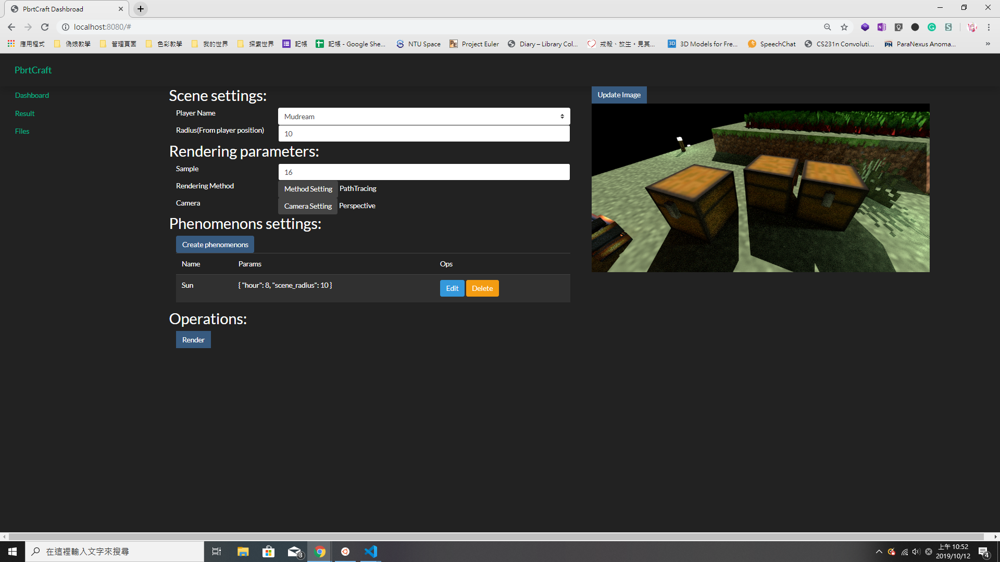

# pbrtcraftdrv

Pbrtcraftdrv Provide Operate GUI for PbrtCraft.



## Build and execute

```bash
$ cd app
$ go build
$ ./app
```

## Pages 

* Dashboard: Main function: using mc2pbrt and pbrt
* Result: Show last rendering result
* Files: Show `workdir` file tree
* Logs: Show logging files

## Config

### App Config File

* Filename: `appconfig.yaml`
  
* Values: 
  * path:
    - workdir: Some temp file
    - mc2pbrt_main: Mc2pbrt compiled binary file or executed command 
    - pbrt_bin: Pbrt compiled binary file
    - log_dir: Logging file directory 

### Server Config File

* Filename: `srvconfig.yaml`
* Values:
  - Port: GUI web server port
